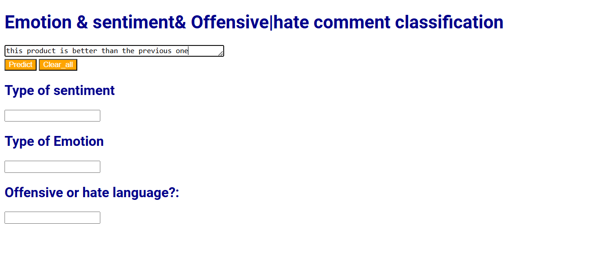
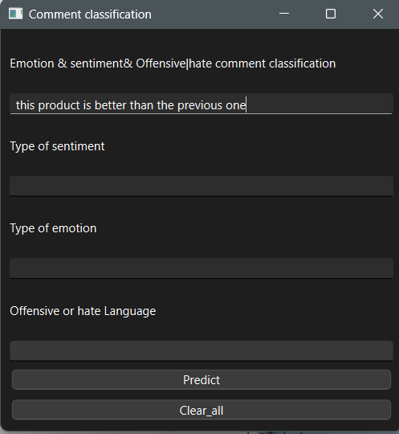
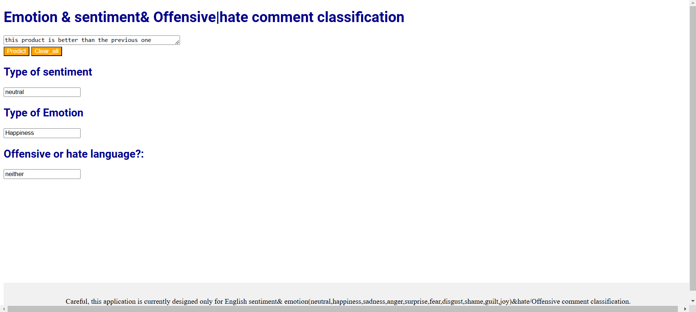
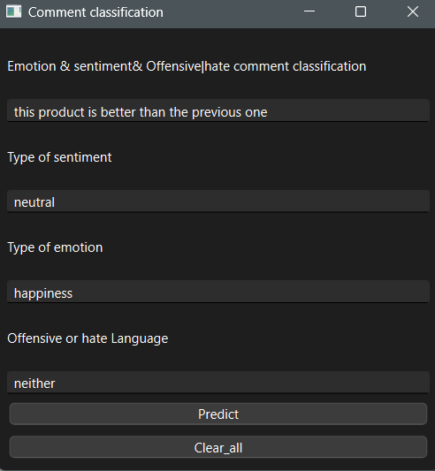

<b><h1>Résumé général </h1></b> 

Trois modèles ont été entraînés pour la classification des sentiments, des émotions et des propos haineux ou offensants dans les commentaires des réseaux sociaux. Ces modèles ont obtenu une valeur d'accuracy supérieure à 0,75 grâce à l'augmentation des données. Les modèles partagent la même architecture, composée d'une couche de convolution, de deux couches LSTM bidirectionnelles, et de deux couches denses. Ces modèles ont ensuite été utilisés pour classifier les commentaires fournis par les utilisateurs. Deux applications ont été conçues : l'une pour une utilisation web et l'autre pour une utilisation sur Windows.

Application flask

Application windows 

Prédiction avec l'application flask

Prédiction avec l'application windows

